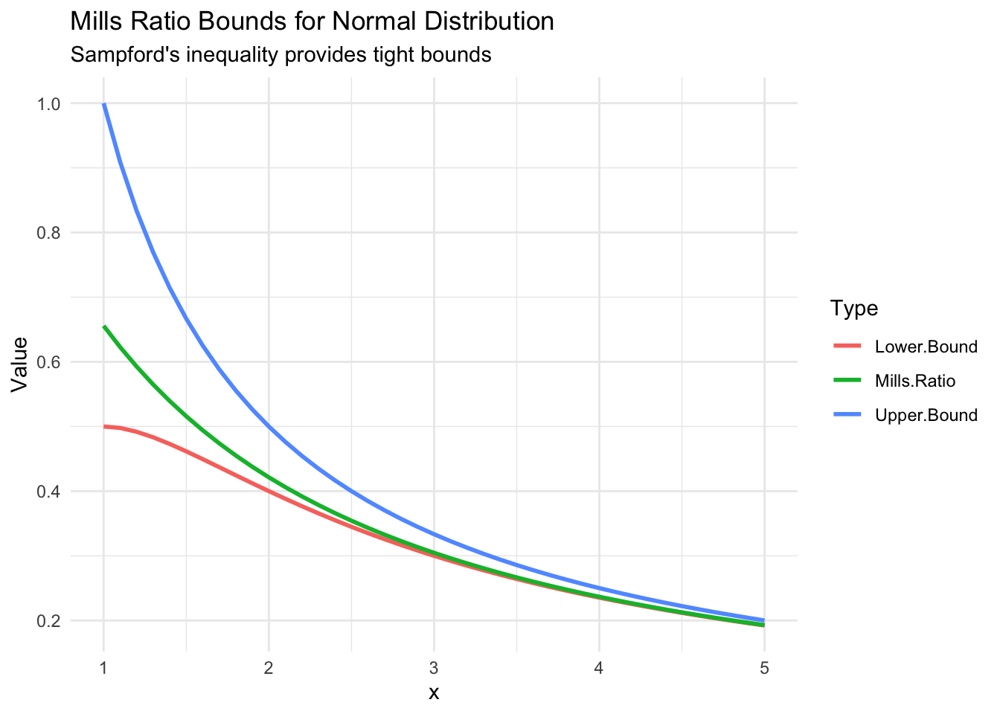

# Mathematical Theory of Mills Ratios

Show code

``` r
library(millsratio)
library(tidyverse)
library(plotly)
```

## Introduction

The Mills ratio, first tabulated by Mills ([1926](#ref-mills1926)),
provides a fundamental measure of tail thickness in probability
distributions. This article explores the mathematical foundations and
theoretical properties of Mills ratios.

## Definition

The Mills ratio is defined as:

``` math
m(x) = \frac{\bar{F}(x)}{f(x)} = \frac{1 - F(x)}{f(x)}
```

where: - $`f(x)`$ is the probability density function - $`F(x)`$ is the
cumulative distribution function - $`\bar{F}(x) = 1 - F(x)`$ is the
survival function

## Asymptotic Behavior

### Normal Distribution

For the standard normal distribution, as $`x \to \infty`$:

``` math
m(x) \sim \frac{1}{x} - \frac{1}{x^3} + \frac{3}{x^5} - \cdots
```

The leading term $`1/x`$ dominates, indicating thin tails.

Show code

``` r
x <- seq(2, 10, by = 0.5)
mills_exact <- mills_ratio_normal(x)
mills_approx <- 1/x

data.frame(
  x = x,
  exact = mills_exact,
  approximation = mills_approx,
  relative_error = abs(mills_exact - mills_approx) / mills_exact
)
```

          x     exact approximation relative_error
    1   2.0 0.4213692     0.5000000    0.186607766
    2   2.5 0.3542651     0.4000000    0.129097919
    3   3.0 0.3045903     0.3333333    0.094366218
    4   3.5 0.2665678     0.2857143    0.071826076
    5   4.0 0.2366524     0.2500000    0.056401786
    6   4.5 0.2125706     0.2222222    0.045404410
    7   5.0 0.1928081     0.2000000    0.037300793
    8   5.5 0.1763230     0.1818182    0.031165512
    9   6.0 0.1623777     0.1666667    0.026413767
    10  6.5 0.1504370     0.1538462    0.022661748
    11  7.0 0.1401042     0.1428571    0.019649373
    12  7.5 0.1310794     0.1333333    0.017195519
    13  8.0 0.1231320     0.1250000    0.015171014
    14  8.5 0.1160821     0.1176471    0.013481802
    15  9.0 0.1097873     0.1111111    0.012058123
    16  9.5 0.1041336     0.1052632    0.010847378
    17 10.0 0.0990286     0.1000000    0.009809323

### Student’s t-Distribution

For the t-distribution with $`\nu`$ degrees of freedom, as
$`x \to \infty`$:

``` math
m(x) \sim \frac{x}{\nu}
```

This linear growth indicates fat tails.

### Exponential Distribution

For the exponential distribution with rate $`\lambda`$:

``` math
m(x) = \frac{1}{\lambda}
```

The constant Mills ratio characterizes the exponential tail decay.

## Inequalities and Bounds

### Sampford’s Inequality

Sampford ([1953](#ref-sampford1953)) established bounds for the normal
Mills ratio:

``` math
\frac{1}{x + 1/x} < m(x) < \frac{1}{x}
```

These bounds become tighter as $`x`$ increases.

Show code

``` r
x <- seq(1, 5, by = 0.1)
mills <- mills_ratio_normal(x)
lower_bound <- 1/(x + 1/x)
upper_bound <- 1/x

plot_data <- data.frame(
  x = x,
  `Mills Ratio` = mills,
  `Lower Bound` = lower_bound,
  `Upper Bound` = upper_bound
) %>%
  pivot_longer(-x, names_to = "Type", values_to = "Value")

ggplot(plot_data, aes(x, Value, color = Type)) +
  geom_line(size = 1) +
  labs(
    title = "Mills Ratio Bounds for Normal Distribution",
    subtitle = "Sampford's inequality provides tight bounds",
    y = "Value"
  ) +
  theme_minimal()
```

    Warning: Using `size` aesthetic for lines was deprecated in ggplot2 3.4.0.
    ℹ Please use `linewidth` instead.



## Relationship to Other Functions

### Hazard Function

The hazard function (failure rate) is the reciprocal of the Mills ratio:

``` math
h(x) = \frac{1}{m(x)} = \frac{f(x)}{\bar{F}(x)}
```

### Error Function

For the normal distribution:

``` math
m(x) = \frac{\sqrt{\pi/2} \cdot \text{erfc}(x/\sqrt{2})}{\exp(-x^2/2)}
```

where $`\text{erfc}`$ is the complementary error function.

## Tail Classification

Mills ratio behavior classifies tail thickness:

| Behavior                   | Tail Type   | Example     |
|----------------------------|-------------|-------------|
| Decreasing ($`m'(x) < 0`$) | Thin        | Normal      |
| Constant ($`m'(x) = 0`$)   | Exponential | Exponential |
| Increasing ($`m'(x) > 0`$) | Fat         | Student’s t |

## Applications in Statistics

### Truncated Distributions

The mean of a truncated normal distribution above point $`a`$ is:

``` math
E[X | X > a] = \mu + \sigma \cdot \frac{1}{m((a-\mu)/\sigma)}
```

### Extreme Value Theory

Mills ratios appear in the study of: - Order statistics - Record
values - Peaks over threshold models

## Computational Considerations

### Numerical Stability

For large $`x`$, direct computation can be unstable. Use:

Show code

``` r
# Unstable for large x
unstable_mills <- function(x) {
  pnorm(x, lower.tail = FALSE) / dnorm(x)
}

# Stable using log scale
stable_mills <- function(x) {
  exp(pnorm(x, lower.tail = FALSE, log.p = TRUE) - dnorm(x, log = TRUE))
}

# Compare at x = 10
x_test <- 10
c(unstable = unstable_mills(x_test),
  stable = stable_mills(x_test),
  package = mills_ratio_normal(x_test))
```

     unstable    stable   package
    0.0990286 0.0990286 0.0990286 

## References

Mills, John P. 1926. “Table of the Ratio: Area to Bounding Ordinate, for
Any Portion of Normal Curve.” *Biometrika* 18 (3/4): 395–400.
<https://doi.org/10.2307/2331957>.

Sampford, M. R. 1953. “Some Inequalities on Mill’s Ratio and Related
Functions.” *The Annals of Mathematical Statistics* 24 (1): 130–32.
<https://doi.org/10.1214/aoms/1177729093>.
